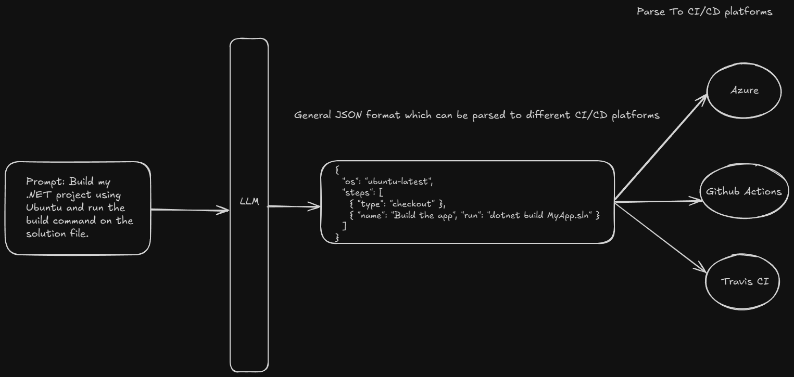

# Pipeline-as-Prompt

A CI/CD pipeline defined via natural language prompts rather than YAML files. Turning human-friendly instructions into structured automation.



## 🧠 Concept Summary

Imagine replacing this YAML:

```yaml
jobs:
  build:
    runs-on: ubuntu-latest
    steps:
      - uses: actions/checkout@v2
      - name: Build the app
        run: dotnet build MyApp.sln
```

With a **prompt** like:

> "Build my .NET project using Ubuntu and run the build command on the solution file."
